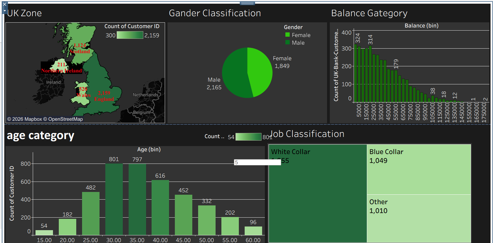
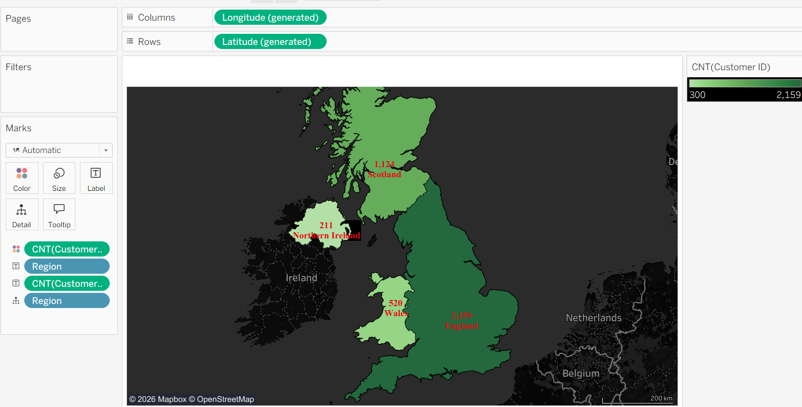
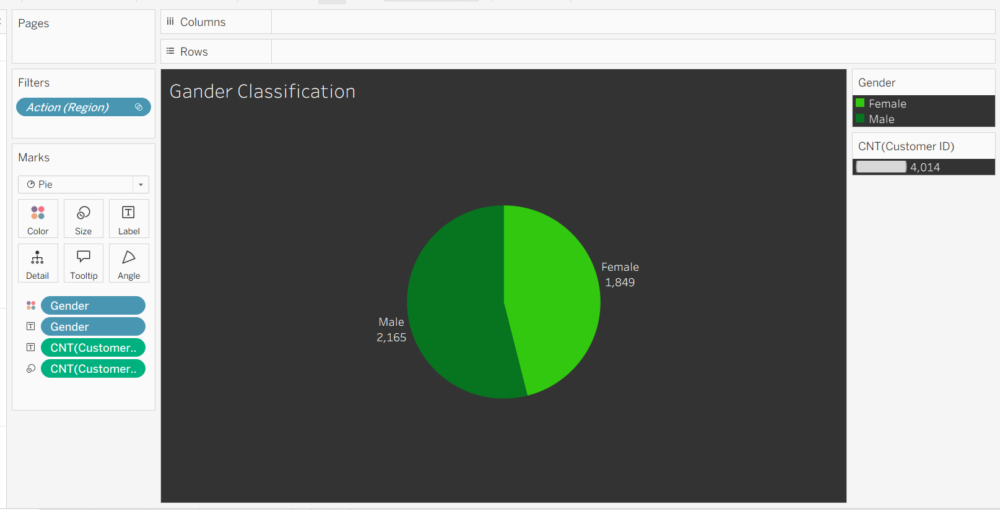
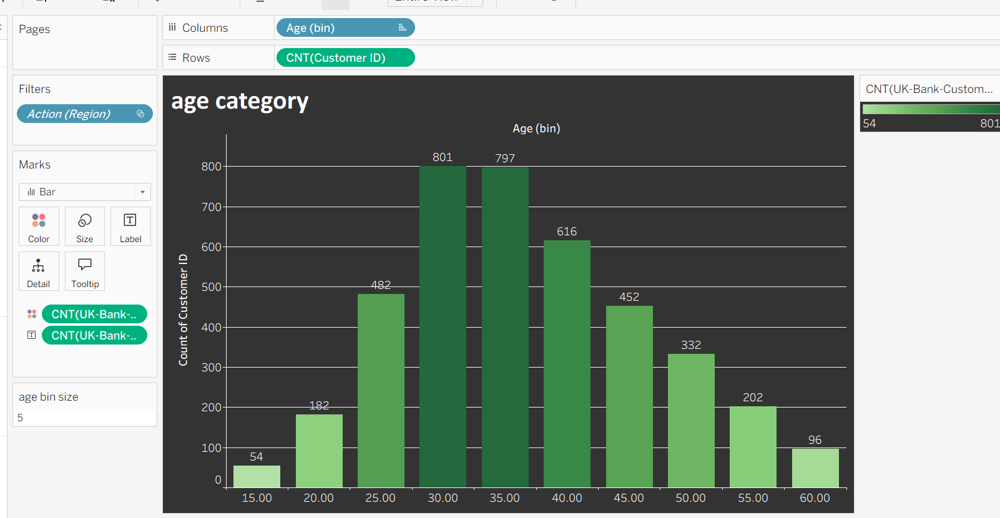
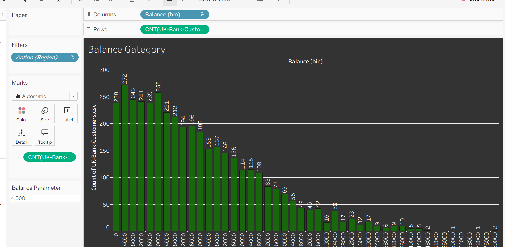
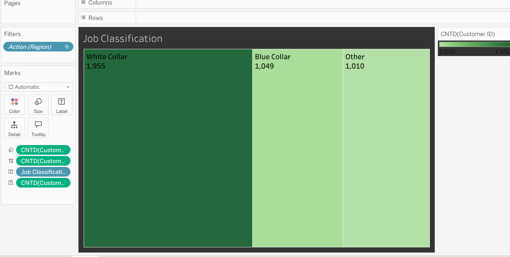

# UK Bank Customers Segmentation Dashboard (Tableau)

This project was created as part of my **ITI Power BI Track training**, where I worked with **Tableau** to build an interactive dashboard for customer segmentation using the **UK-Bank-Customers dataset**.

This was my **first hands-on experience with Tableau**, focusing on data visualization, dashboard design, and interactive analytics.

---
## Dashboard Preview

## 📊 Dashboard Overview

The dashboard analyzes customer distribution across different dimensions such as **region, gender, job classification, age, and balance**.

It allows users to explore customer segments interactively using filters and parameters.

---

## 🧩 Features

### 1️⃣ Region Map
- Displays **customer count by UK region**
- Works as an **interactive filter** that controls all other charts in the dashboard

### 2️⃣ Gender Distribution
- **Pie chart** showing the number of customers by gender

### 3️⃣ Job Classification
- **Treemap visualization** showing customer distribution across job categories

### 4️⃣ Age Distribution
- **Bar chart with dynamic age bins**
- Bin size is controlled by a **user parameter**

### 5️⃣ Balance Distribution
- **Bar chart with dynamic balance bins**
- Users can change bin size using a **balance bin parameter**

---

## ⚙️ Tableau Concepts Used

- Parameters
- Calculated Fields
- Dynamic Bins
- Dashboard Filters
- Interactive Map
- Treemap Visualization
- Dashboard Layout Design

---

## 🎨 Dashboard Design

The dashboard was designed with a **dark theme layout** to improve readability and create a more modern visualization style.

Design improvements include:
- Custom titles and fonts
- Organized dashboard layout
- Consistent color palette
- Interactive filtering between visualizations

---

## 📂 Dataset

Dataset used in this project:
